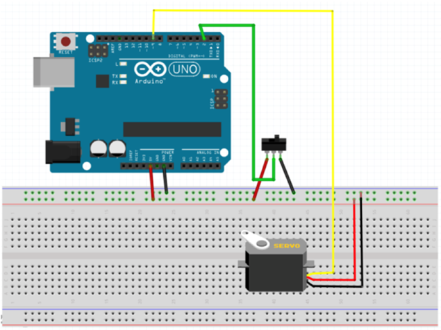

# useless-machine

용산철도고등학교의 1인 1기업 프로젝트 강의 아이템.

스위치와 닿는 stick 끝에 고무 패드를 붙이는것을 추천합니다.

비영리 목적으로 사용하신다면 개발자의 허락 없이 사용하셔도 괜찮습니다.

wiring diagram

부품목록

아두이노 우노 R3 보드 https://www.devicemart.co.kr/goods/view?no=1245596

9V 배터리 스냅 단자 https://www.devicemart.co.kr/goods/view?no=1323045

토글 스위치 https://www.devicemart.co.kr/goods/view?no=1794

점퍼 케이블 https://www.devicemart.co.kr/goods/view?no=1328409

서보모터 https://www.devicemart.co.kr/goods/view?no=1313389
